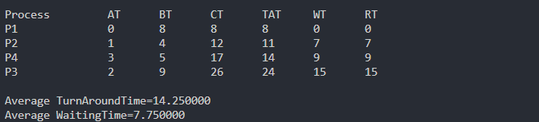
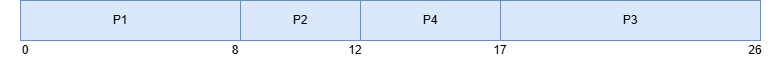

# PENJELASAN SJF PREEMTIVE WITH ARRIVAL TIME

## HAVID ROSIHANDANU 
## 3124500048

```c
struct proc {
    int no, at, bt, it, ct, tat, wt;
};
```
> struct diatas mendefinisikan nomor proses, arrival time, burst time, idle time, completion time, Turnaround Time dan waiting time

```c
struct proc read(int i) {
    struct proc p;
    printf("\nProcess No: %d\n",i);
    p.no = i;
    printf("Enter Arrival Time: ");
    scanf("%d",&p.at);
    printf("Enter Burst Time: ");
    scanf("%d",&p.bt);
    return p;
}
```
> fungsi diatas membaca input dari user berupa jumlah proses, arrival time dan burst time

```c
int n, j, min = 0;
float avgtat = 0, avgwt = 0;
struct proc p[10], temp;
```
> Code diatas mendefinisikan n : Jumlah proses, min : Indeks proses dengan burst time terkeci, temp : Variabel sementara untuk sorting.

```c
printf("<--SJF Scheduling Algorithm (Non-Preemptive)-->\n");
printf("Enter Number of Processes: ");
scanf("%d", &n);
```
> Code diatas digunakan untuk menampung input dari user dan menyimpannya pada variable n 

```c
for(int i = 0; i < n; i++)
    p[i] = read(i + 1);
```
> Code diatas merupakan Looping untuk mengisi data semua proses menggunakan fungsi read().

```c
for(int i = 0; i < n - 1; i++)
    for(j = 0; j < n - i - 1; j++)    
        if(p[j].at > p[j + 1].at) {
            temp = p[j];
            p[j] = p[j + 1];
            p[j + 1] = temp;
        }   
```
> Code diatas digunakan untuk Mengurutkan proses berdasarkan Arrival Time terkecil ke terbesar 

```c
for(j = 1; j < n && p[j].at == p[0].at; j++)
    if(p[j].bt < p[min].bt)
        min = j;
temp = p[0];
p[0] = p[min];
p[min] = temp;
```
> Code diatas digunakan untuk Mencari proses dengan burst time terkecil di antara proses yang memiliki arrival time sama dengan proses pertama. Lalu Tukar posisi proses pertama dengan proses tersebut.
```c
p[0].it = p[0].at;
p[0].ct = p[0].it + p[0].bt;
```
> Code diatas digunakan untuk perhitungan it (Idle Time) = Arrival Time (karena proses langsung dieksekusi). ct = Idle Time + Burst Time.

```c
for(int i = 1; i < n; i++) {
    // Cari proses dengan burst time terkecil yang sudah tiba
    for(j = i + 1, min = i; j < n && p[j].at <= p[i - 1].ct; j++)
        if(p[j].bt < p[min].bt)
            min = j;
    
    // Tukar posisi proses
    temp = p[i];
    p[i] = p[min];
    p[min] = temp;
    
    // Hitung Idle Time
    if(p[i].at <= p[i - 1].ct)
        p[i].it = p[i - 1].ct;
    else
        p[i].it = p[i].at;
    
    // Hitung Completion Time
    p[i].ct = p[i].it + p[i].bt;
}
```
> Code diatas digunakan untuk penjadwalan proses selanjutnya dengan algoritma  :  
1.Untuk setiap proses i, cari proses dengan burst time terkecil yang memiliki arrival time ≤ Completion Time proses sebelumnya (p[i-1].ct).
2.Tukar posisi proses i dengan proses yang ditemukan.
3.Hitung it: 
 *  Jika proses tiba sebelum/saat proses sebelumnya selesai: it = ct proses sebelumnya. 
 *  Jika proses tiba setelah proses sebelumnya selesai: it = at proses tersebut.
4.Hitung ct = it + bt.

```c
printf("\nProcess\t\tAT\tBT\tCT\tTAT\tWT\tRT\n");
for(int i = 0; i < n; i++) {
    p[i].tat = p[i].ct - p[i].at;
    avgtat += p[i].tat;
    p[i].wt = p[i].tat - p[i].bt;
    avgwt += p[i].wt;
    printf("P%d\t\t%d\t%d\t%d\t%d\t%d\t%d\n", p[i].no, p[i].at, p[i].bt, p[i].ct, p[i].tat, p[i].wt, p[i].wt);
}
```
> Coide diatas digunakan untuk perhitungan Turnaround Time (TAT) = CT - AT,  Waiting Time (WT) = TAT - BT, Response Time (RT) = WT (karena non-preemptive).

```c
avgtat /= n, avgwt /= n;
printf("\nAverage TurnAroundTime=%f\nAverage WaitingTime=%f", avgtat, avgwt);
```
> Code diatas digunakan untuk Menampilkan rata-rata TAT dan WT.


## HASIL COMPILE


## GANTT CHART


## TABLE SJF NON PREEMTIVE WITH ARRIVAL TIME
| proses |arrival time | burst time  |
| :----- | :---------: | :---------: |
| P1     | 0           |8            |
| P2     | 1           |4            |
| P3     | 2           |9            |
| P4     | 3           |5            |

## KESIMPULAN 
> SJF non preemtive with arrival time merupakan algoritma penjadwalan cpu yang memiliki mekasnisme sebagai berikut : 
1. Mencari proses yang telah tiba (arrival time-nya kurang dari atau sama dengan waktu saat ini).
2. Dari proses-proses yang telah tiba dan belum selesai dieksekusi, memilih proses dengan burst time terkecil untuk dieksekusi selanjutnya.
3. Mengeksekusi proses yang terpilih hingga selesai (karena ini adalah versi non-preemptive).
4. Setelah proses selesai, waktu saat ini akan maju, dan langkah 1-3 akan diulang sampai semua proses selesai.