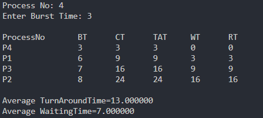
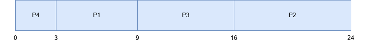

# Penjelasan Kode SJF Scheduling dengan Analogi

## Struktur Kode Program

### 1. Definisi Struct `proc`

```c
struct proc {
    int no, bt, ct, tat, wt;
};
```
> struct diatas digunakan untuk  menyimpan informasi proses, termasuk nomor proses (no), burst time (bt), completion time (ct), turnaround time (tat), dan waiting time (wt).

```c
struct proc read(int i) {
    struct proc p;
    printf("\nProcess No: %d\n", i);
    p.no = i;
    printf("Enter Burst Time: ");
    scanf("%d", &p.bt);
    return p;
}
``` 
>Fungsi diatas membaca input burst time untuk setiap proses dan mengembalikan objek proc yang telah diisi.

```c
struct proc p[10], tmp;
float avgtat = 0, avgwt = 0;
int n, ct = 0;`
> Code diatas Deklarasi variabel untuk menyimpan data proses, waktu penyelesaian (ct), dan rata-rata TAT/WT.
```

```c
printf("<--SJF Scheduling Algorithm Without Arrival Time (Non-Preemptive)-->\n");
printf("Enter Number of Processes: ");
scanf("%d", &n);
```
> Code diatas digunakan untuk input jumlah dari proses

```c
for(int i = 0; i < n; i++)
    p[i] = read(i + 1);
```
> Code diatas merupakan looping untuk mengisi burst time setiap proses    

```c
for(int i = 0; i < n - 1; i++)
    for(int j = 0; j < n - i - 1; j++)    
        if(p[j].bt > p[j + 1].bt) {
            tmp = p[j];
            p[j] = p[j + 1];
            p[j + 1] = tmp;
        }
 ```
> Proses diurutkan berdasarkan burst time terkecil ke terbesar (SJF). Proses dengan burst time lebih kecil diprioritaskan.

```c
for(int i = 0; i < n; i++) {
    ct += p[i].bt;
    p[i].ct = p[i].tat = ct;
    avgtat += p[i].tat;
    p[i].wt = p[i].tat - p[i].bt;
    avgwt += p[i].wt;
}
```
>Completion Time (CT): Waktu penyelesaian proses diakumulasi.
Turnaround Time (TAT): TAT = CT (karena arrival time = 0).
Waiting Time (WT): WT = TAT - Burst Time.

```c
printf("\nProcessNo\tBT\tCT\tTAT\tWT\tRT\n");
for(int i = 0; i < n; i++)
    printf("P%d\t\t%d\t%d\t%d\t%d\t%d\n", p[i].no, p[i].bt, p[i].ct, p[i].tat, p[i].wt, p[i].wt);

avgtat /= n, avgwt /= n;
printf("\nAverage TurnAroundTime=%f\nAverage WaitingTime=%f", avgtat, avgwt);
```
> Code diats digunakan untuk Menampilkan hasil perhitungan dan rata-rata TAT/WT.

## hasil eksekusi


## Gantt Chart


## Table SJF without arrival time
| proses | burst time |
| :----- | :---------: |
| P1     | 6           |
| P2     | 8           |
| P3     | 7           |
| P4     | 3           |
