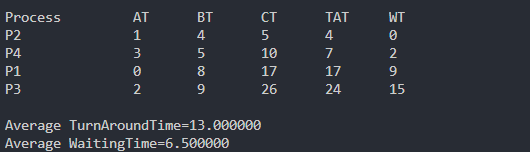
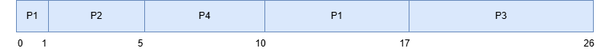

# PENJELASAN SRTF PREEMTIVE

## HAVID ROSIHANDANU 
## 3124500048

```c
#include<stdio.h>
#define MAX 9999
struct proc
{
    int no, at, bt, rt, ct, tat, wt;
};
```
> Struct diatas Menyimpan informasi proses seperti nomor, waktu kedatangan (at), waktu burst (bt), sisa waktu eksekusi (rt), waktu selesai (ct), turnaround time (tat), dan waiting time (wt).

```c
struct proc read(int i)
{
    struct proc p;
    printf("\nProcess No: %d\n", i);
    p.no = i;
    printf("Enter Arrival Time: ");
    scanf("%d", &p.at);
    printf("Enter Burst Time: ");
    scanf("%d", &p.bt);
    p.rt = p.bt; // Inisialisasi sisa waktu
    return p;
}
```
> Code diatas membaca input dari user dan menyimpannya 

```c
struct proc p[10], temp;
float avgtat = 0, avgwt = 0;
int n, s, remain = 0, time;
```
> Code diatas inisialisasi :
 * p[10]: Array proses (maksimal 10 proses).
 * temp: Untuk sorting.
 * avgtat, avgwt: Menyimpan rata-rata TAT dan WT.
 * n: Jumlah proses.
 * s: Indeks proses dengan sisa waktu terkecil.
 * remain: Counter proses yang selesai.
 * time: Simulasi waktu.

```c
printf("<--SRTF Scheduling Algorithm (Preemptive)-->\n");
printf("Enter Number of Processes: ");
scanf("%d", &n);
for(int i = 0; i < n; i++)
    p[i] = read(i+1);
```
> Code diatas meminta input jumlah proses dan data setiap proses menggunakan fungsi read

```c
for(int i = 0; i < n-1; i++)
    for(int j = 0; j < n-i-1; j++)    
        if(p[j].at > p[j+1].at)
        {
            temp = p[j];
            p[j] = p[j+1];
            p[j+1] = temp;
        }
```
> Code diatas digunakan untuk Mengurutkan proses berdasarkan waktu kedatangan (at) menggunakan Bubble Sort.

```c
printf("\nProcess\t\tAT\tBT\tCT\tTAT\tWT\n");
p[9].rt = MAX; 
```
> Code diatas digunakan untuk menyiapkan format output. p[9].rt diatur ke MAX sebagai pembanding awal. Potensi Bug jika jumlah proses (n) = 10, karena p[9] adalah proses valid.

```c
for(time = 0; remain != n; time++)
{
    s = 9;
    for(int i = 0; i < n; i++)
        if(p[i].at <= time && p[i].rt < p[s].rt && p[i].rt > 0)
            s = i;
    p[s].rt--;
    if(p[s].rt == 0)
    {
        remain++;
        p[s].ct = time + 1;
        p[s].tat = p[s].ct - p[s].at;
        avgtat += p[s].tat;
        p[s].wt = p[s].tat - p[s].bt;
        avgwt += p[s].wt;
        printf("P%d\t\t%d\t%d\t%d\t%d\t%d\n", p[s].no, p[s].at, p[s].bt, p[s].ct, p[s].tat, p[s].wt);
    }
}
```
> Code diatas menggunakan algoritma preemtive dengan prioritas proses yang memiliki sisa waktu terpendek dengan mekanisme : 
* Pilih Proses: Setiap satuan waktu (time), cari proses dengan rt terkecil yang sudah tiba (at <= time).
* Eksekusi Proses: Kurangi rt proses terpilih.
* Proses Selesai: Jika rt = 0, hitung ct, tat, wt, dan tampilkan hasil.

```c
avgtat /= n, avgwt /= n;
printf("\nAverage TurnAroundTime=%f\nAverage WaitingTime=%f", avgtat, avgwt);
```
> Code diatas digunakan untuk menghitung dan menampilkan rata-rata TAT dan WT

## HASIL COMPILE


## GANTT CHART


## TABLE STRF PREEMTIVE
| proses |arrival time | burst time  |
| :----- | :---------: | :---------: |
| P1     | 0           |8            |
| P2     | 1           |4            |
| P3     | 2           |9            |
| P4     | 3           |5            |

## KESIMPULAN 
> SRTF adalah algoritma penjadwalan CPU preemptive yang memprioritaskan proses dengan sisa waktu eksekusi tersingkat untuk dijalankan terlebih dahulu. dengan mekanisme sebagai berikut :
1. Pada setiap satuan waktu, CPU memilih proses yang sudah tiba (arrival time ≤ waktu saat ini) dan memiliki remaining time (sisa burst time) paling kecil.
2. Jika ada proses baru yang tiba dengan sisa waktu lebih pendek dari proses yang sedang berjalan, CPU akan menghentikan proses saat ini (preempt) dan beralih ke proses baru tersebut.