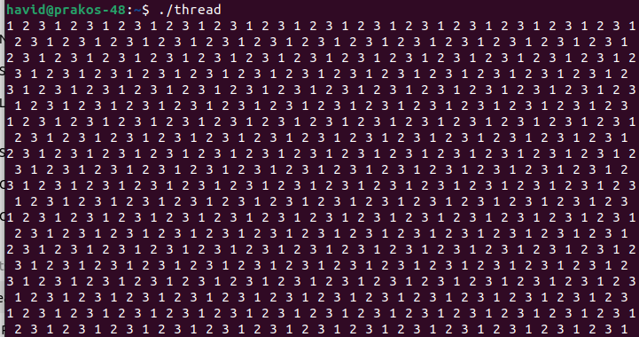

### Code

```c
#include <pthread.h>
#include <stdio.h>

pthread_cond_t cond1 = PTHREAD_COND_INITIALIZER;
pthread_cond_t cond2 = PTHREAD_COND_INITIALIZER;
pthread_cond_t cond3 = PTHREAD_COND_INITIALIZER;

pthread_mutex_t lock = PTHREAD_MUTEX_INITIALIZER;

int done = 1;

void *foo(void *n) {
  while (1) {

    pthread_mutex_lock(&lock);

    if (done != (int)*(int *)n) {

      if ((int)*(int *)n == 1) {
        pthread_cond_wait(&cond1, &lock);
      } else if ((int)*(int *)n == 2) {
        pthread_cond_wait(&cond2, &lock);
      } else {
        pthread_cond_wait(&cond3, &lock);
      }
    }
    printf("%d ", *(int *)n);

    if (done == 3) {
      done = 1;
      pthread_cond_signal(&cond1);
    } else if (done == 1) {
      done = 2;
      pthread_cond_signal(&cond2);
    } else if (done == 2) {
      done = 3;
      pthread_cond_signal(&cond3);
    }

    pthread_mutex_unlock(&lock);
  }

  return NULL;
}

int main() {
  pthread_t tid1, tid2, tid3;
  int n1 = 1, n2 = 2, n3 = 3;

  pthread_create(&tid1, NULL, foo, (void *)&n1);
  pthread_create(&tid2, NULL, foo, (void *)&n2);
  pthread_create(&tid3, NULL, foo, (void *)&n3);

  while (1);

  return 0;
}
```

### hasil


### Kesimpulan
Program diatas akan terus berjalan tidak ada hentinya, untuk menghentikan dapat menggunakan kombimasi tombol crtl + c
Program tersebut menggunakan 3 thread untuk mencetak angka 1, 2, dan 3 secara bergiliran terus-menerus. Sinkronisasi antar thread dilakukan dengan:
 1. pthread_mutex_t: Mengatur akses bersama ke variabel done  
 2. pthread_cond_t: Masing-masing thread memiliki condition variable untuk menunggu gilirannya
Thread hanya mencetak angka jika nilai done sesuai dengan ID-nya. Setelah mencetak, thread akan memberi sinyal ke thread berikutnya untuk melanjutkan.
Tujuan: Menjaga urutan output agar selalu: 1 2 3 1 2 3 


