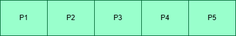
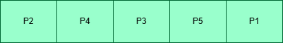
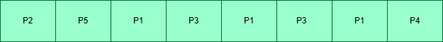
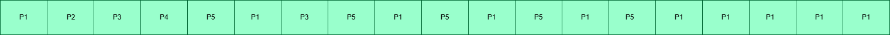

### Soal Nomor 3  
**Pertanyaan:**  
*Apakah keuntungan menggunakan time quantum size di level yang berbeda dari sebuah antrian sistem multilevel?*

#### **Jawaban**
1. **Menyesuaikan kebutuhan proses berdasarkan prioritas**  
   - **Proses prioritas tinggi (misal interaktif)** butuh respons cepat, jadi diberi time quantum kecil agar sering dijadwalkan → responsif.  
   - **Proses prioritas rendah (misal background task)** bisa diberi time quantum besar → mengurangi overhead karena lebih jarang preempted.

2. **Meningkatkan efisiensi CPU**  
   - Proses yang cepat selesai (short jobs) dapat diselesaikan lebih cepat di level atas.  
   - Proses panjang turun ke level bawah, sehingga tidak mengganggu proses cepat.

3. **Mengurangi context switch yang tidak perlu**  
   - Di level bawah, time quantum yang besar → proses berjalan lebih lama → lebih sedikit context switching, artinya overhead sistem lebih kecil.  

4. **Mendukung strategi aging dan keadilan**  
   - Proses lambat yang sering turun level tetap bisa dapat waktu CPU, dan seiring waktu bisa dipromosikan kembali (dalam MLFQ).  
   - Sistem lebih fair untuk berbagai jenis proses: CPU-bound, I/O-bound, interaktif, dsb.

---

### Soal Nomor 4  
**Gambarkan 4 diagram Chart yang mengilustrasikan eksekusi dari proses-proses tersebut menggunakan FCFS, SJF, prioritas nonpreemptive dan round robin.**

#### **Tabel Proses:**  
| Proses | Burst Time | Prioritas |  
|--------|------------|-----------|  
| P1     | 10         | 3         |  
| P2     | 1          | 1         |  
| P3     | 2          | 3         |  
| P4     | 1          | 4         |  
| P5     | 5          | 2         |  

---

### 📘 FCFS (First Come First Serve)

Pada FCFS scheduling, mengeksekusi proses sesuai waktu kedatangan.  
**Langkah eksekusi:**
- P1 → datang duluan → jalan dulu  
- P2  
- P3  
- P4  
- P5  

---

### 📙 SJF (Shortest Job First)

Pada SJF scheduling, menjalankan proses dengan burst time paling kecil terlebih dahulu.  
**Langkah eksekusi:**
- P2 → paling cepat (1)  
- P4 → 2 unit  
- P3 → 3 unit  
- P5 → 4 unit  
- P1 → terakhir karena burst time terbesar (10)  

---

### 📗 Priority (Non-Preemptive)

Pada Priority scheduling, prioritas yang paling sedikit maka dia paling tinggi (contoh: 1 adalah prioritas tertinggi).  
**Langkah eksekusi:**
- P2 dieksekusi pertama karena prioritas tertinggi (1).  
- P5 dieksekusi berikutnya (juga prioritas 1, datang setelah P2).  
- P1 dijalankan (prioritas 2).  
- P3 dijalankan (prioritas 3).  
- P4 terakhir (prioritas 4).  

---

### 📕 Round Robin (Quantum = 1)

Pada Round Robin scheduling, setiap proses akan dijalankan berdasarkan quantum.  
Ketika ada proses yang burst time melebihi quantum, maka akan dijalankan sesuai quantum dan sisanya masuk antrian untuk dijalankan di akhir.  
**Langkah eksekusi:**
- P1 → 1 unit  
- P2 → 1 unit  
- P3 → 1 unit  
- P4 → 1 unit  
- P5 → 1 unit  
- Kembali ke P1 → 1 unit  
- P3 → 1 unit  
- P5 → 1 unit  
- P1 → 1 unit  
- P5 → 1 unit  
- P1 → 1 unit  
- P5 → 1 unit  
- P1 → 1 unit  
- P1 → 1 unit  
- P1 → 1 unit  
 